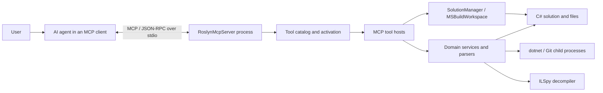

# RoslynMcpServer architecture and constraints

This document describes the current runtime architecture, its invariants, and the constraints that matter when extending or operating the server. It is implementation guidance, not a list of MCP tool parameters; live schemas and `get_tool_help` remain authoritative for individual tools.

## System context

RoslynMcpServer is a local, stateful MCP server for C# repositories. An MCP client hosts an AI agent, starts the server as a child process, and communicates with it over JSON-RPC on standard input/output.

The server does not contain an autonomous agent or choose which tool to invoke. It exposes capabilities and structured guidance; the client-side agent plans and calls them. Repository-level `AGENTS.md` rules are therefore part of the effective system: they tell the agent when and how to use the server.

## Runtime composition

Startup is intentionally ordered:

1. `Program.cs` registers a process-bitness-compatible MSBuild before Roslyn workspace types are used.
2. Roslyn C# workspace and feature assemblies are force-loaded for MEF discovery.
3. `ROSLYN_MCP_WORKSPACE`, when set, establishes the repository working directory. The publish directory must not become the working directory.
4. The .NET Generic Host configures Serilog, dependency injection, MCP stdio transport, prompts, and the selected tool surface.
5. Tool factories and process-wide shared services are registered; tool constructor dependencies are resolved through DI.

Key runtime components:

- `Hosting/McpToolCatalog.cs` is the single source of truth for public tool names, host methods, groups, lite-core membership, and read/write/process classification.
- `Hosting/RoslynMcpServiceCollectionExtensions.cs` builds the MCP host and registers shared services.
- `Hosting/McpToolActivationService.cs` manages process-wide tool activation for `full` and `lite` profiles.
- `Tools/*.cs` are protocol adapters: they validate MCP arguments, call services, and format context-bounded responses.
- `Services/*.cs` implement workspace, editing, decompilation, process execution, package, test, and project operations.
- `Diagnostics/*.cs` parse noisy external output and turn it into actionable MCP responses.
- `RoslynMcpServer.Tests` references the server project and tests catalogs, parsers, path/SDK handling, workspace synchronization, and tool orchestration.
- `docs/compact-tools/` records the historical implementation epochs for the compact catalog; it is not the operator or contributor architecture reference.
- `docs/workspace-load-cache/` is a **forward-looking** plan (faster load of large solutions, disk evaluation snapshot). It is not shipped behavior. Do not treat those epochs as the current workspace lifecycle.

The solution has two projects and one dependency edge: `RoslynMcpServer.Tests` references `RoslynMcpServer`.

## Tool surface

The tool surface is catalog-driven at method granularity. Registration must not be duplicated in a parallel `WithTools<T>()` list.

- `full` is the default and registers every public tool.
- `lite` starts with the `core` group.
- Additional groups can be selected at startup with `ROSLYN_MCP_TOOL_GROUPS`.
- `enable_tool_group` can append a group to the live process and emits one `tools/list_changed` notification for a real change.
- Runtime disable is not supported.

`McpRuntimeToolCollection` batches additions because the MCP SDK collection normally raises a change event per tool. Its implementation reflects over an SDK private field, so an MCP SDK upgrade must verify this class and its integration tests.

The current host is stdio and effectively has one MCP session per process. `SolutionManager`, tool activation, and the runtime tool collection are process-wide singletons. Reusing this registration unchanged in a future HTTP or multi-session host would leak workspace and activation state across sessions.

## Workspace lifecycle

`SolutionManager` owns the active `MSBuildWorkspace`, loaded `Solution`, load properties, and disk watcher.

1. `load_workspace` opens one `.sln`, `.slnx`, or `.csproj` and caches it **in process** by path plus MSBuild configuration, platform, and target framework. That cache dies with the MCP process. There is no on-disk evaluation cache yet; planned work is in [`docs/workspace-load-cache/`](workspace-load-cache/README.md).
2. Semantic tools consume the current in-memory Roslyn snapshot.
3. Saved `.cs` changes are queued by `FileSystemWatcher` and applied in a batch before the next semantic operation.
4. Server-initiated Roslyn edits are written asynchronously to disk and applied back to the workspace.
5. `reset_workspace` disposes the workspace and clears all cached state.

Important consistency rules:

- Unsaved editor buffers are invisible; only content written to disk reaches the server.
- Changes to `.csproj`, `.sln`, `.slnx`, or `Directory.Build.*` mark the project graph stale. Source text can still synchronize, but references, compile globs, and generated files require `load_workspace` again, or `reset_workspace` followed by `load_workspace`.
- Relative file paths are resolved against the loaded workspace directory. Before a workspace is loaded they fall back to the process working directory.
- Workspace operations are serialized by a semaphore. This protects the mutable Roslyn state, but long workspace operations can delay other semantic calls.
- The file watcher ignores build/VCS directories and suppresses immediate self-write events. Watcher overflow or platform watch limits degrade to a broader refresh; they do not provide editor-buffer synchronization.
- A repo-wide `Directory.Build.props` that overrides `OutputPath` (e.g. into a shared `artifacts` folder instead of the SDK default `bin\{Configuration}\{TFM}\`) is honored by MSBuildWorkspace design-time evaluation for `Project.OutputFilePath` / `CompilationOutputInfo`, but an analyzer/generator project referenced via `OutputItemType="Analyzer"` can still end up with a stale or missing `AnalyzerReference.FullPath` if that DLL was built to a different location than the one the referencing project's design-time evaluation resolved, silently disabling source generation for the referencing project. `load_workspace`'s optional `logProjectOutputDiagnostics` flag (`Services/ProjectOutputDiagnosticsLogger.cs`) logs each project's resolved output/generated-file paths and each `AnalyzerReference`'s existence/timestamp to the MCP server log to make this diagnosable without instrumenting MSBuild itself. It only reports facts; it does not change resolution or fix stale analyzer references.
- The fix for the case above is `load_workspace`'s optional `shadowCopyInSolutionAnalyzers` flag (`Services/AnalyzerReferenceShadowCopier.cs`): for every `AnalyzerReference` whose file name matches another (unambiguous) in-solution project's `AssemblyName`, it copies that project's own resolved output (`CompilationOutputInfo.AssemblyPath` / `OutputFilePath`) into an immutable content-hashed generation under `v2-main-only/` in a private per-solution shadow root (OS temp). v1.3.5 used last-write-time directory names and recopied on document edit; v1.3.6 prepares at load/enable/explicit refresh only and reapplies an in-memory original↔shadow mapping with no analyzer file I/O. Loading happens through `Services/InProcessAnalyzerAssemblyLoader.cs`, a process-lifetime public-API-only `IAnalyzerAssemblyLoader` owned by `SolutionManager`. v1.3.7 (epoch 3) chose **restart-required** for same-identity generator updates: cached load and `reset_workspace` prepare new files but refuse in-process execution with an explicit restart action; a new MCP process runs V2. Supported dependency policy is **main-only** — private helpers are refused, not copied from output and not resolved by first-match simple name. `reset_workspace` does not unload CLR assemblies. This also solves the second half of the pitfall: the MCP process only ever locks the shadow copy, never the analyzer project's real build output, so a later `dotnet build` of that project does not fail with `MSB3027`. Removal condition: drop this workaround if Roslyn ships a public non-locking analyzer loader, or if MSBuildWorkspace's own `AnalyzerReference` resolution is fixed to honor a referenced project's actual `OutputPath`.
  - **Costly pitfall found and fixed during implementation (do not reintroduce):** the rewritten solution must never be pushed into the real `MSBuildWorkspace` via `Workspace.TryApplyChanges`. `MSBuildWorkspace` supports `ApplyChangesKind.AddAnalyzerReference`/`RemoveAnalyzerReference` by editing the backing `.csproj` on disk. Confirmed against the `C:\Scratch\GenRepro` repro: calling `TryApplyChanges` (a) injected a machine-/session-specific temp shadow path as a new literal `<Analyzer Include=...>` MSBuild item into the real `Consumer.csproj`, and (b) could not remove the original `ProjectReference OutputItemType="Analyzer"` reference — it is synthesized by MSBuild from the `ProjectReference`, not a literal `<Analyzer>` item the project-file writer knows how to delete — so both ended up active and the generator ran twice, producing `CS0102`/`CS0111` duplicate-member errors on the very next real `dotnet build`. `SolutionManager` therefore keeps the rewrite purely in-memory. `ShadowCopyInSolutionAnalyzerReferencesAsync` prepares immutable generations and stores a session mapping. `GetCurrentSolution()` returns the stored `_solution` snapshot (fallback `workspace.CurrentSolution`); it does **not** recopy analyzer files or recompute the overlay. Document edit, watcher flush, and post-apply call `PublishInMemorySolution`, which reapplies the mapping (when execution is permitted) and the epoch-3 binding gate onto `workspace.CurrentSolution` with no analyzer file I/O. Same-identity in-process refresh strips in-solution analyzer refs before compilation so stale V1 cannot run. `FindDocumentAsync` reads through `GetCurrentSolution()`. All production writes go through one workspace write boundary (v1.3.8): preflight of the operation's session/mapping, exact inverse of known original↔shadow replacements (not a whole-list wipe), persist, `TryApplyChanges`, reconciliation of texts that actually reached disk, then publish the prepared mapping with no analyzer file I/O. Unsupported or stale analyzer diffs are rejected before any server write.
  - **Known, separate Roslyn limitation (not fixed by this workaround):** `SymbolFinder.FindDeclarationsAsync`/`FindSourceDeclarationsAsync` (used by `find_symbol_definition`) never searches source-generated documents at all — confirmed [by design and closed](https://github.com/dotnet/roslyn/issues/63375) by the Roslyn team ("all these systems work off of indices cached for real documents... no bandwidth or desire to update them for SG scenarios"). So `find_symbol_definition` on a generator-emitted type name returns "not found" even with `shadowCopyInSolutionAnalyzers` correctly applied, while `get_diagnostics_for_file` / semantic-model-based tools on a file that *references* the generated type correctly see it (no `CS0103`). `find_symbol_references` still works once a usage site is known, since it builds the symbol from a real document's semantic model, not from `SymbolFinder`'s name-based declaration search.
  - Full history of this investigation — MVP repro, v1.3.4 disk corruption, v1.3.5 in-memory overlay, v1.3.6 immutable mapping, v1.3.8 write boundary — is in [`docs/analyzer-shadow-copy/`](analyzer-shadow-copy/README.md) and [`docs/analyzer-shadow-copy-improvements/v2/`](analyzer-shadow-copy-improvements/v2/README.md). Read it before changing this area again.
- `shadowCopyInSolutionAnalyzers` is opt-in and is never inferred by the server or client. When enabled, load/refresh prepares content-hashed generations under the OS temp directory. Document synchronization reapplies the mapping without analyzer I/O. Published generations have no automatic GC; operator cleanup requires every owning process to have stopped and the path to sit under the known cache parent.
- A working-set value above 1.5 GB produces a warning, not a memory limit or eviction policy.

## Main execution paths

### Semantic navigation and diagnostics

Navigation tools use Roslyn symbols and `SymbolFinder`; file diagnostics use a document semantic model. They require a successfully loaded workspace and are preferable to text search for C# declarations, usages, implementations, and call relationships.

### Editing and refactoring

AST tools use Roslyn syntax APIs, `DocumentEditor`, formatting, and `Workspace.TryApplyChanges`. Code fixes resolve Roslyn `CodeAction` instances and persist the resulting solution changes. Text replacement and full-file writes exist for non-semantic or headless workflows, but an IDE-native editor remains preferable when its diff review is part of the user workflow.

### Build, test, run, and NuGet

Execution tools start a matching `dotnet` host in the repository working directory. They do not build through `MSBuildWorkspace`.

- SDK environment handling honors a repository `global.json` and removes inherited IDE/MSBuild overrides that would select the wrong SDK.
- Build uses a bounded multi-step probe and structured MSBuild/NuGet parsing. The effective result follows build steps, so a later restore cannot mask a failed build.
- Tests separate the optional compile step from `dotnet test --no-build`; the VSTest parser therefore receives test output rather than an MSBuild warning dump. When `binariesPath` is set, compile is `dotnet build <loaded.sln> -t` (same solution-folder target as `run_dotnet_build` `projectName`) and VSTest runs `{AssemblyName}.dll` from that directory; the DLL is not required on disk until after that compile if `noBuild=false`.
- `get_test_list` discovers tests by scanning loaded Roslyn syntax for xUnit/NUnit/MSTest attributes. It is not VSTest. Optional `projectName` and `nameContains` run before the `maxResults` cap. Unknown or ambiguous `projectName` is an error against the loaded project list, not an empty JSON payload.
- Timeouts and cancellation attempt to kill the complete child-process tree.
- Process output is parsed and truncated before it is returned to protect the agent context window.

These tools execute with the permissions and network access of the MCP process. They are not a sandbox.

### External assembly inspection

ILSpy-backed tools resolve an exact assembly file from an explicit path, loaded workspace references, `.deps.json`, NuGet cache, or known BCL package mappings. Fuzzy filename matching is intentionally avoided. Full type decompilation has a line limit; large types must be inspected through a skeleton and individual method bodies.

## Diagnostic and observability model

Tools return human-readable Markdown rather than raw compiler or process logs. Parsers classify MSBuild, NuGet, workspace-load, and VSTest output, while fallbacks include bounded head/tail excerpts when a known format cannot be recognized.

Serilog writes rolling files under `logs/` next to the executable:

- incoming JSON-RPC logging is enabled by default and can be disabled with `MCP_LOG_INCOMING_RPC=0`;
- parameter logging is capped by `MCP_LOG_INCOMING_RPC_MAX_CHARS`;
- tool telemetry logs compact outcome/highlight lines by default;
- `ROSLYN_MCP_LOG_TOOL_OUTPUT=full` logs complete tool responses.

Logs can contain repository paths, source fragments, command arguments, and MCP parameters. Do not pass secrets in prompts or tool arguments, and apply normal access controls and retention rules to the log directory.

## Architectural constraints

The following are invariants, not optional conventions:

1. **MSBuild must be registered first.** Do not touch Roslyn/MSBuild workspace types before `MsBuildBootstrapper.Register()`.
2. **Bitness and SDK selection must agree.** A 64-bit server cannot load an x86 MSBuild. Repository SDK pins belong in `global.json`; child process environment must remain aligned with them.
3. **Cross-targeting needs an inner TFM.** A project evaluated with `TargetFrameworks` can expose an outer build without `Compile`; retry `load_workspace` with one `targetFramework`.
4. **Workspace and CLI state are related but distinct.** `targetFramework` controls Roslyn design-time evaluation and is not inherited by build tools. Configuration/platform and session `buildArgs` have their documented inheritance rules.
5. **Disk is the synchronization boundary.** No editor API supplies unsaved buffers to the server.
6. **Project graph changes require reload.** Incremental `.cs` synchronization cannot update package references, project references, or compile item graphs.
7. **The current state model is single-session.** Do not expose the singleton registrations through a multi-user transport without introducing per-session workspace and activation scopes.
8. **Tool responses must remain bounded.** New process, search, and decompile features need result caps, cancellation, and concise failure fallbacks.
9. **Public tool metadata has one owner.** Add or change a tool through `McpToolCatalog`, its attributed method/schema, help entry when needed, and catalog tests.
10. **Publishing must stay non-single-file unless dynamic loading is redesigned and verified.** Roslyn, MSBuild BuildHost, analyzers, and MEF discover assemblies at runtime.
11. **Runtime group activation is SDK-version-sensitive.** `McpRuntimeToolCollection` depends on MCP SDK internals and must be revalidated on package upgrades.
12. **Filesystem/process access is privileged.** The server trusts the client and operating-system identity; it does not confine operations to the loaded workspace.

## Extending the server

For a new or changed MCP tool:

1. Keep protocol validation and response formatting in the appropriate `Tools` host.
2. Put reusable behavior in `Services` or output classification in `Diagnostics`.
3. Add the `[McpServerTool]` and `[Description]` metadata with accurate prerequisites, side effects, defaults, and limits.
4. Add the tool once to `McpToolCatalog` with the correct group and classification.
5. Register new constructor dependencies in `RoslynMcpServiceCollectionExtensions`; do not construct heavyweight services inside tools.
6. Add focused xUnit coverage for the service/parser and catalog or activation behavior.
7. Update `README.md` tool history/reference and `AGENTS.md.sample` only when agent-visible policy changes.
8. Build and test through the MCP tools. For a shippable behavior change, apply the repository versioning and publish/reload procedure.

Prefer cancellation-aware async I/O, minimal diffs, and deterministic helper logic. New long-running operations need an explicit budget and a context-safe response shape.

## Deployment and compatibility

The executable targets .NET 10 and is published self-contained for the RIDs declared in `RoslynMcpServer.csproj`. `PublishReadyToRun` is enabled and `PublishSingleFile` is disabled.

This repository currently has no `global.json`; local SDK selection therefore follows the installed environment. Consumer repositories should normally pin the SDK they require.

Operational compatibility depends on three independently versioned surfaces:

- the MCP client and its support for stdio, JSON Schema, and `tools/list_changed`;
- the MCP C# SDK used by the host;
- Roslyn/MSBuild/.NET SDK compatibility for the target repository.

When runtime behavior differs from the source tree, verify the binary with `get_mcp_server_info`: MCP clients continue using the published process until it is republished and reloaded.
