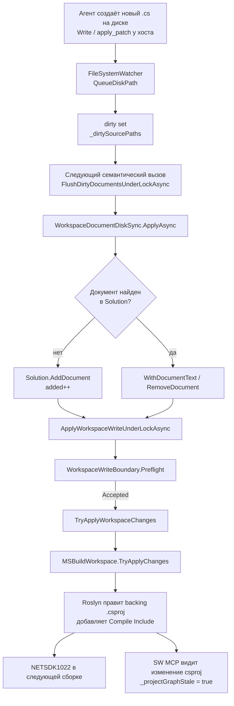

# Disk-sync мутирует `.csproj` (проблема)

Дата: 2026-09-20. Статус: **shipped 1.3.30, I-5 follow-up 1.3.31; archived**.
Runtime — [ARCHITECTURE.md](../../ARCHITECTURE.md) и корневой README. Этот пакет —
история дефекта, не живой контракт. Спека патча — [spec.md](spec.md).
Process — [_archive/](_archive/README.md).

Базовая версия на момент записи: **1.3.29**. Последствия исправления — SemVer
и docs-обновления по `.cursor/rules/roslyn-mcp-version-bump.mdc`.

## 1. Симптом

Периодически после появления **нового** `.cs` файла в SDK-style проекте в
`.csproj` оказывается явный item:

```xml
<Compile Include="Services\TestAttributeMatcher.cs" />
```

Следующая сборка падает:

```
error NETSDK1022: Duplicate 'Compile' items were included. ...
The duplicate items were: 'Services\TestAttributeMatcher.cs'
```

Ни один MCP-тул этого item не пишет: агент в чате его только **удаляет**.
Симптом выглядел как «хук/автоматизм IDE дописал csproj». Проверено:

| Источник | Результат |
|---|---|
| `.cursor/rules/*.mdc`, `.cursor/hooks*` | хуков нет, только `rules/` |
| `%USERPROFILE%\.cursor\hooks.json`, `%APPDATA%\Cursor\**\hooks.json` | отсутствуют |
| `.git/hooks` | только `*.sample` |
| `git config core.hooksPath` | не задан |
| Транскрипты чатов (11 независимых случаев) | item только **удаляется**, никогда не добавляется |
| `Services/ProjectFileHelper.cs` | единственный writer `.csproj`; пишет только `PackageReference` |

Значит, item пишет **сам RoslynMcpServer**.

## 2. Механизм



Пошагово, с точками в коде:

1. **Watcher** помечает новый `.cs` как dirty (только исходники, не
   `bin`/`obj`):

```1836:1841:Services/SolutionManager.cs
        if (!WorkspaceDiskPathFilter.IsCSharpSource(fullPath))
        {
            return;
        }

        _dirtySourcePaths.TryAdd(fullPath, 0);
```

2. **Flush** (любой семантический вызов: symbol-тулы, `update_file_content`,
   `run_specific_test` с `noBuild`, `find_usages`, …) строит candidate solution:

```1648:1653:Services/SolutionManager.cs
        var result = await WorkspaceDocumentDiskSync.ApplyAsync(
            workspace.CurrentSolution,
            dirty,
            refreshAll,
            _pathComparison,
            cancellationToken).ConfigureAwait(false);
```

3. **`AddDocument`** — новый файл добавляется в `Solution`, потому что папка
   попадает под каталог проекта. Никакой проверки, входит ли файл в
   project graph (globs / явные `<Compile>`), нет:

```120:135:Services/WorkspaceDocumentDiskSync.cs
            var project = FindContainingProject(current, fullPath, pathComparison);
            if (project is null)
            {
                unchanged++;
                continue;
            }

            var folders = GetDocumentFolders(project, fullPath, pathComparison);
            var newId = DocumentId.CreateNewId(project.Id, debugName: Path.GetFileName(fullPath));
            current = current.AddDocument(
                newId,
                Path.GetFileName(fullPath),
                SourceText.From(diskText),
                folders,
                filePath: fullPath);
            added++;
```

4. **Write boundary** не проверяет состав документов проекта — только
   analyzer references и freshness:

```75:81:Services/WorkspaceWriteBoundary.cs
        var cleaned = mapping is null
            ? candidate
            : mapping.InvertKnownReplacements(candidate, workspaceCurrent, loader);
        cleaned = SemanticPublicationState.RestoreExcludedReferences(
            cleaned,
            workspaceCurrent,
            excludedReferences);
```
```83:112:Services/WorkspaceWriteBoundary.cs
        foreach (var projectId in cleaned.ProjectIds.ToList())
        {
            var project = cleaned.GetProject(projectId);
            if (project is null)
            {
                continue;
            }

            var workspaceProject = workspaceCurrent.GetProject(projectId);
            ...
            if (!AnalyzerReferencesEquivalent(project.AnalyzerReferences, workspaceProject.AnalyzerReferences))
            {
                return new WorkspaceWritePreflight(
                    false,
                    "unknown-analyzer-diff",
                    null);
            }
        }
```

5. **Flush вызывает write boundary** с `persistDocuments: false` (документ не
   переписывается), но `TryApplyChanges` всё равно исполняется:

```1679:1688:Services/SolutionManager.cs
        var rawBase = workspace.CurrentSolution;
        var context = CreateVerifiedWriteContext(_solution, rawBase);
        var write = await ApplyWorkspaceWriteUnderLockAsync(
                result.Solution,
                rawBase,
                context,
                persistDocuments: false,
                alreadyOnDisk,
                cancellationToken)
            .ConfigureAwait(false);
```
```1250:1250:Services/SolutionManager.cs
        if (TryApplyWorkspaceChanges(workspace, cleaned))
```
```933:939:Services/SolutionManager.cs
        if (!workspace.TryApplyChanges(cleaned))
        {
            return false;
        }

        NoteRawWorkspaceRevision();
        return true;
```

6. **`MSBuildWorkspace.TryApplyChanges` с `AddDocument` правит backing
   `.csproj`.** Это by design Roslyn: `MSBuildWorkspace` поддерживает
   `ApplyChangesKind.AddDocument` через редактирование файла проекта. В этом
   репозитории тот же механизм уже был зафиксирован для analyzer references:

> `MSBuildWorkspace` supports `ApplyChangesKind.AddAnalyzerReference` /
> `RemoveAnalyzerReference` by **editing the backing project file** — this is
> by design — `docs/archive/analyzer-shadow-copy/epoch-2-first-fix-attempt-and-disk-corruption.md`

7. **SDK-style проект** уже включает файл через glob → явный
   `<Compile Include>` дублирует его → `NETSDK1022`.

8. **Побочный эффект**: watcher самого MCP видит изменение `.csproj` и
   выставляет `_projectGraphStale`, из-за чего следующий `load_workspace`
   сбрасывает кэш загрузки — самонаведённый шум:

```1829:1834:Services/SolutionManager.cs
        if (WorkspaceDiskPathFilter.IsProjectGraphFile(fullPath))
        {
            _projectGraphStale = true;
            _logger.LogInformation("Project graph file changed on disk: {Path}", fullPath);
            return;
        }
```

## 3. Доказательства из логов MCP

Логи: `bin/Release/net10.0/win-x64/publish/logs/mcp-<date>.log`. Ключ —
`workspace_disk_sync ... added=N` (N>0) и `Project graph file changed on disk`
**непосредственно перед** ним; обе строки пишет процесс MCP.

### 3.1. `Services/TestAttributeMatcher.cs` (2026-09-20, этот репо)

```
20:08:11  tools/call run_specific_test (noBuild=true)
20:08:13.69  Project graph file changed on disk: RoslynMcpServer.csproj
20:08:13.90  workspace_disk_sync updated=7 added=1 removed=0 unchanged=195 write="FullSuccess"
20:08:46  ❌ Pre-test build failed: NETSDK1022 ... duplicate items were: 'Services\TestAttributeMatcher.cs'
```

### 3.2. `Diagnostics\TestOutputReportOptions.cs` (2026-09-17)

```
11:54:21  tools/call run_specific_test (noBuild=true)
11:54:22.895  Project graph file changed on disk: RoslynMcpServer.csproj
11:54:23.012  workspace_disk_sync updated=7 added=1 removed=0 unchanged=190 write="FullSuccess"
11:55:29  NETSDK1022 ... duplicate items were: 'Diagnostics\TestOutputReportOptions.cs'
```

### 3.3. `AnalyzerLifecycle\*` (2026-09-11) — ровно кейс A1-01

```
16:25:02  Project graph file changed on disk: RoslynMcpServer.csproj
16:25:02  Project graph file changed on disk: RoslynMcpServer.Tests.csproj
16:25:02.246  workspace_disk_sync updated=3 added=11 removed=0 unchanged=143
16:26:23  NETSDK1022 ... 'AnalyzerLifecycle\AnalyzerLifecycleFactAttribute.cs'; ...
```

Уже зафиксировано как факт в
[../analyzer-shadow-copy-improvements/v2/epoch-1-acceptance.md](../analyzer-shadow-copy-improvements/v2/epoch-1-acceptance.md)
(A1-01), но там записано как «явный `<Compile Include>` дублировал SDK glob»,
без указания, **кто** его написал.

### 3.4. Чужой репозиторий `MobsAdmin.Web.Tests` (2026-09-18)

```
14:21:29  tools/call load_workspace  (C:\Repos\kavkis\KAVKISTools\mobsadmin\mobs-admin.sln)
14:21:34.797  Project graph file changed on disk: ...\MobsAdmin.Web.Tests.csproj
14:21:34.815  workspace_disk_sync updated=0 added=1 removed=0 unchanged=0 write="FullSuccess"
14:22:17  NETSDK1022 ... duplicate items were: 'SectionRouteChromeTests.cs' [MobsAdmin.Web.Tests.csproj]
```

Этот случай окончательно снимает версию про «хук этого репозитория»: MCP
мутировал `.csproj` **другого решения**, по одному вызову `load_workspace`
(`added=1`, `updated=0`).

### 3.5. Сводка по дням

Во всех случаях, где после flush запускалась сборка, `added>0`
сопровождается `NETSDK1022` (там, где сборки не было, — записано явно):

| Дата | Событие | added | Что задвоилось |
|---|---|---|---|
| 09-09 21:00 | flush | 1 | (сборки не было) |
| 09-11 16:25 | flush | **11** | `AnalyzerLifecycle\*` |
| 09-11 16:41 | flush | 1 | (сборки не было) |
| 09-12 13:24 | flush | 1 | `AnalyzerProvenance*` |
| 09-12 17:50 | flush | 1 | — |
| 09-12 19:09 | flush | 3 | `V3*` |
| 09-12 19:40 | flush | 3 | `V3*` |
| 09-14 10:18 | flush | 2 | — |
| 09-14 12:16 | flush | 1 | — |
| 09-15 13:38 | flush | 2 | — |
| 09-16 19:57 | flush | 1 | — |
| 09-16 21:22 | flush | 1 | — |
| 09-17 11:54 | flush | 1 | `Diagnostics\TestOutputReportOptions.cs` |
| 09-18 14:21 | `load_workspace` | 1 | `SectionRouteChromeTests.cs` (**чужой репо**) |
| 09-20 20:08 | flush | 1 | `Services\TestAttributeMatcher.cs` |

## 4. Почему это не ловят существующие тесты

`RoslynMcpServer.Tests/AnalyzerLifecycle/Epoch1WritePathTests.cs` и
`Epoch4WorkspaceWriteTests.cs` проверяют, что `.csproj` байт-в-байт не
изменился (`snapshotCsproj` + SHA), но редактируют **уже существующие**
документы. Ветка «FSW нашёл новый файл → `result.Added > 0` →
`AddDocument` → `TryApplyChanges`» не покрыта ни одним тестом, поэтому
регрессия проходит зелёной.

## 5. Классификация

| ID | Sev | Тема | Статус |
|---|---|---|---|
| D-01 | Blocker | `MSBuildWorkspace.TryApplyChanges` пишет `<Compile Include>` в `.csproj` при `AddDocument` | open |
| D-02 | High | `WorkspaceDocumentDiskSync` добавляет в `Solution` любой `.cs` под каталогом проекта, не проверяя project graph (globs, `Compile Remove`, `EnableDefaultCompileItems=false`) | open |
| D-03 | High | `WorkspaceWriteBoundary.Preflight` не проверяет diff **состава документов** проекта, только analyzer references | open |
| D-04 | Medium | Ошибка видна только на следующей сборке; в ответе тула успех (`write="FullSuccess"`), оператор/агент не получает предупреждения | open |
| D-05 | Medium | Мутация `.csproj` взводит `_projectGraphStale` в самом MCP → лишний сброс load-кэша | open |
| D-06 | Medium | Нет теста на «новый `.cs` на диске → csproj не меняется» | open |
| D-07 | Low | Симметричный случай: удаление/переименование `.cs` (`RemoveDocument`) — та же природа мутации, отдельно не проверено | open |
| D-08 | Low | Известный баг повторно воспроизводился ≥15 раз; документально зафиксирован как «чья-то правка csproj» (A1-01), что уводило диагностику в сторону | open |

## 6. Что **не** является причиной (проверено)

- Cursor hooks / `hooks.json` / git hooks — отсутствуют.
- Агентские вызовы редактирования `.csproj` — в транскриптах item только
  удалялся.
- Расширения IDE — мутация воспроизводится на `.csproj` чужого репозитория
  из вызова `load_workspace` (см. 3.4).

## 7. Связанные документы

- [../analyzer-shadow-copy/epoch-2-first-fix-attempt-and-disk-corruption.md](../analyzer-shadow-copy/epoch-2-first-fix-attempt-and-disk-corruption.md)
  — precedent: `TryApplyChanges` уже правил реальный `.csproj` (`<Analyzer Include>`), исправлено переходом на in-memory overlay.
- [../analyzer-shadow-copy/epoch-3-inmemory-overlay-fix.md](../analyzer-shadow-copy/epoch-3-inmemory-overlay-fix.md)
  — правило «overlay никогда не через `TryApplyChanges`».
- [../analyzer-shadow-copy-improvements/v2/epoch-1-acceptance.md](../analyzer-shadow-copy-improvements/v2/epoch-1-acceptance.md)
  — A1-01, первый зафиксированный случай NETSDK1022.
- [../../ARCHITECTURE.md](../../ARCHITECTURE.md) — workspace lifecycle, write boundary.

## 8. Принятое направление

Выбран **вариант A**. Норма патча — [spec.md](spec.md).
