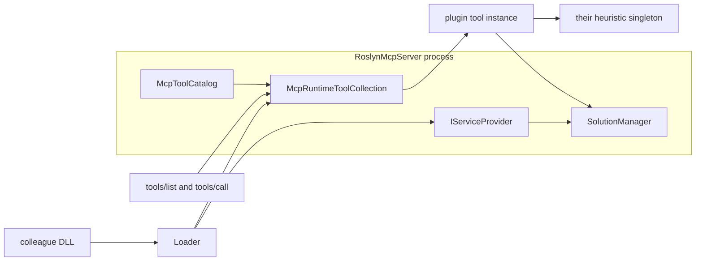

# Плагины MCP

Дата: 2026-09-22. Статус: **концепция, код не начат**. Канон этой темы.
Основание — исходники **1.4.14**. Runtime не меняется, пока нет явного запроса
на реализацию загрузчика.

Чужой test-impact остаётся у коллег. Этот репозиторий даёт только шов:
загрузить их сборку, зарегистрировать её тулы и отдать им тот же процесс,
тот же `SolutionManager` и тот же загруженный `Solution`, что у встроенных тулов.

## Что уже есть

- Тул — класс с `[McpServerTool]` и конструктором. Схема для агента берётся
  из атрибутов, как у [`NavigationTools`](../../Tools/NavigationTools.cs):
  туда уже инжектятся `SolutionManager` и `ILogger<T>`.
- Фабрика в [`McpToolDescriptor.CreateFactory`](../../Hosting/McpToolDescriptor.cs)
  вызывает `ActivatorUtilities.CreateInstance` — зависимости приходят из того же
  `IServiceProvider`.
- [`McpRuntimeToolCollection.TryAddMany`](../../Hosting/McpRuntimeToolCollection.cs)
  умеет добавить тулы в живую коллекцию SDK и один раз поднять `Changed`.
- [`SolutionManager`](../../Services/SolutionManager.cs) публичный:
  `GetPublishedSolutionAsync`, `FindDocumentAsync`, `ResolvePathAgainstWorkspace`,
  диск-синк. Рядом уже публичны `CallGraphHelper`, `TestDiscoveryHelper`,
  `GitChangedFilesHelper`.
- Каталог [`McpToolCatalog`](../../Hosting/McpToolCatalog.cs) — закрытый список
  встроенных имён. Плагинные тулы в него не входят: иначе разъедутся тесты,
  lite/full и help.

## Модель



Плагин — обычная class library `net10.0`, не self-contained. Хост
(self-contained publish, не single-file) грузит её при старте, до
`host.RunAsync()`, поэтому первый `tools/list` уже видит новые тулы.
Отдельный hot-reload не входит в концепцию: пересобрали DLL — Reload MCP,
как после publish сервера.

Пример тула у коллег. Их эвристика в этот репозиторий не переносится:

```csharp
public sealed class TestImpactTools
{
    public TestImpactTools(SolutionManager solutions, ImpactHeuristic heuristic) { }

    [McpServerTool(Name = "impact_affected_tests", Title = "Tests affected by a change")]
    [Description("...")]
    public async Task<string> FindAffectedTests(string filePath, CancellationToken cancellationToken = default)
    {
        var solution = await solutions.GetPublishedSolutionAsync(cancellationToken);
        // Roslyn + их эвристика на этом же Solution
    }
}

public sealed class TestImpactPlugin : IRoslynMcpPlugin
{
    public string Name => "test-impact";

    public void Register(RoslynMcpPluginContext context)
    {
        context.Services.AddSingleton<ImpactHeuristic>();
        context.AddToolsFrom<TestImpactTools>();
    }
}
```

`IRoslynMcpPlugin` нужен, чтобы они зарегистрировали свои синглтоны до
`host.Build()`. Сами тул-классы хост создаёт на вызов так же, как встроенные.
Свой `MSBuildWorkspace` плагин не поднимает.

## Контракт «внутренняя кухня»

Плагин компилируется против сборки `RoslynMcpServer` (`Private=false`,
runtime-ассеты не копировать) и против `ModelContextProtocol` того же мажора,
что у хоста. В рантайме загрузчик отдаёт уже загруженные сборки хоста по имени:
`RoslynMcpServer`, `ModelContextProtocol`, `Microsoft.CodeAnalysis.*`,
`Microsoft.Extensions.*`. Тогда `SolutionManager` в плагине и в хосте — один тип,
DI сходится.

Публичные сервисы и хелперы — это кухня, которой пользуются встроенные тулы.
`internal` (например `SymbolSelectionHelper`, `NavigationListingHelper`,
overlay/publication) остаётся внутренним. Если impact-анализу нужен конкретный
internal-хелпер, его отдельно выводят в public API хоста под этот сценарий.
`InternalsVisibleTo` на произвольные имена сборок контрактом не является:
приватные сигнатуры меняются каждым патчем.

Совместимость: плагин собирают против той же `Version`, что запущена. Хост
сверяет заявленную минимальную версию (атрибут на сборке плагина) и при
несовпадении мажора сборку пропускает.

## Откуда брать сборки

Только явные пути. Обход cwd и профиля пользователя не используется: cwd у
Cursor часто домашний каталог.

- Каталог `{BaseDirectory}/plugins/` рядом с опубликованным exe — drop-in.
- Ключ `plugins` в [`RoslynMcp.jsonc`](../../RoslynMcp.jsonc.sample) (массив
  файлов или каталогов) и/или `ROSLYN_MCP_PLUGINS` — для dev-цикла, когда DLL
  лежит в `bin` их репозитория и копировать её в publish не надо.

Один битый плагин не роняет сервер: stderr + лог, остальные тулы живы. Имя
тула, совпавшее со встроенным каталогом или с другим плагином, пропускается.
Имена плагинных тулов несут префикс манифеста (`impact_`), чтобы не столкнуться
с будущими встроенными именами.

Профиль `lite`/`full` плагины не фильтрует. Раз сборка подключена, её тулы
в списке. В `list_tool_groups` они не входят. `get_mcp_server_info` показывает
имя плагина, путь и имена тулов. `get_tool_help` для них берёт `[Description]`,
отдельных статей в `McpToolHelpCatalog` нет.

Сборка плагина исполняется с правами процесса MCP. Это локальный stdio-хост;
путь должен быть осознанным.

## Граница репозитория

Когда реализацию попросят отдельно, в публичный код входит загрузчик, контекст
регистрации, ключ конфига, строка в `get_mcp_server_info` и тестовая
фикстура-плагин без бизнес-эвристики. Метод коллег и проектные эвристики
остаются у них.

Вне этой концепции: выгрузка ALC, hot-load без рестарта, песочница, сеть/NuGet
как источник плагинов.
