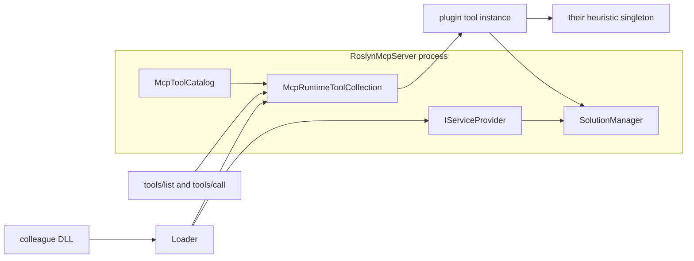

# Плагины MCP

Дата: 2026-09-28. Статус: **эпохи 1 и 2 выполнены** ([архив](_archive/README.md)); эпоха 3 не начата.
Текущий контракт этой темы. Предыдущий текст —
[_archive/v1/](../_archive/v1/README.md) — нормой не является.

Ревизия арбитража [_archive/arbitration/](../_archive/arbitration/result.md)
от 2026-09-27. Решения человека по `P-001`…`P-015` — принять как есть. Отчёт —
[../revision/result.md](../revision/result.md). Основание поведения хоста —
исходники **1.4.15**. Пока эпохи не выполнены, runtime не меняется.

Как собрать плагин — в [authoring.md](authoring.md). Это не абзац продуктового
README и не комментарий к примеру ниже. Эпохи ниже исполняют этот контракт и
не заменяют его.

## Эпохи

По порядку. Следующая не начинается, пока предыдущая не закоммичена. Файлы между
эпохами не общие, кроме трёх случаев: `samples/RoslynMcpPlugin/plugin.json` —
эпоха 4 создаёт, эпоха 6 меняет только `minHostVersion`; `RoslynMcpServer.csproj`
— эпоха 4 добавляет исключение `samples\**` из `Compile` и `None` (включая
generated `.cs` под `obj` шаблона), эпоха 7 это исключение не снимает; таблица
ниже — эпоха меняет только свою строку на «сделана».

Перед первым C# в эпохе читать [docs/code-style.md](../../code-style.md). Один
независимый тип на файл. Тесты — xUnit, без `Assert.Skip`, без категории
`AnalyzerLifecycle` (шард `unit`).

Патч `Version` / `AssemblyVersion` / `FileVersion` — только эпоха 6. `PackageVersion`
нет.

| Эпоха | Файл | Статус |
|---|---|---|
| 1. Регистрация тулов | [epoch-1-registration.md](_archive/epoch-1-registration.md) | сделана |
| 2. Манифест и пути | [epoch-2-manifest-and-paths.md](_archive/epoch-2-manifest-and-paths.md) | сделана |
| 3. Теневая копия | [epoch-3-shadow-copy.md](epoch-3-shadow-copy.md) | не начата |
| 4. Шаблон | [epoch-4-sample-plugin.md](epoch-4-sample-plugin.md) | не начата |
| 5. Загрузка сборки | [epoch-5-assembly-load.md](epoch-5-assembly-load.md) | не начата |
| 6. Старт хоста | [epoch-6-host-startup.md](epoch-6-host-startup.md) | не начата |
| 7. Документация | [epoch-7-documentation.md](epoch-7-documentation.md) | не начата |

Чужой test-impact остаётся у коллег. Этот репозиторий даёт только шов:
загрузить их сборку, зарегистрировать её тулы и отдать им тот же процесс,
тот же `SolutionManager` и тот же загруженный `Solution`, что у встроенных тулов.

## Что уже есть

- Тул — класс с `[McpServerTool]` и конструктором. Схема для агента берётся
  из атрибутов, как у [`NavigationTools`](../../../Tools/NavigationTools.cs):
  туда уже инжектятся `SolutionManager` и `ILogger<T>`.
- Фабрика в [`McpToolDescriptor.CreateFactory`](../../../Hosting/McpToolDescriptor.cs)
  вызывает `ActivatorUtilities.CreateInstance` — зависимости приходят из того же
  `IServiceProvider`.
- [`McpRuntimeToolCollection.TryAddMany`](../../../Hosting/McpRuntimeToolCollection.cs)
  умеет добавить тулы в живую коллекцию SDK и один раз поднять `Changed`.
- [`SolutionManager`](../../../Services/SolutionManager.cs) публичный, в
  `RoslynMcpServer.Services`: `GetPublishedSolutionAsync`,
  `GetPublishedSolutionAfterDiskSyncAsync`, `GetSanitizedPublishedSolutionAsync`,
  `FindDocumentAsync`, `ResolvePathAgainstWorkspace`, диск-синк. Рядом уже публичны
  `CallGraphHelper`, `TestDiscoveryHelper`, `GitChangedFilesHelper`. `internal`-члены
  этого типа (оракул последней загрузки и швы `FailNext*`) видны только тестам и
  lifecycle-хосту через `InternalsVisibleTo`, не сборке плагина. Новый метод
  `SolutionManager` эта серия не добавляет.
- Каталог [`McpToolCatalog`](../../../Hosting/McpToolCatalog.cs) — закрытый список
  встроенных имён. Плагинные тулы в него не входят: иначе разъедутся тесты,
  lite/full и help.

Три уже существующих входа. Анализ, который должен совпасть со встроенными
semantic-тулами, вызывает `GetSanitizedPublishedSolutionAsync`.

- `GetPublishedSolutionAsync` возвращает опубликованный снимок и очередь
  disk watcher не применяет.
- `GetPublishedSolutionAfterDiskSyncAsync` применяет очередь диска и возвращает
  сырой опубликованный снимок. Заглушки `UnresolvedAnalyzerReference` он не снимает.
- `GetSanitizedPublishedSolutionAsync` применяет очередь диска и возвращает снимок
  без этих заглушек. Опубликованный снимок он не подменяет: health, overlay и
  admission по-прежнему видят отсутствующие analyzer path. Этот вход берут
  встроенные semantic-тулы.

## Модель



Плагин — обычная class library `net10.0`, не self-contained. Хост
(self-contained publish, не single-file) грузит её при старте, до
`host.RunAsync()`, поэтому первый `tools/list` уже видит новые тулы.
Отдельный hot-reload не входит в концепцию: пересобрали DLL — Reload MCP,
как после publish сервера.

Пример тула у коллег. Их эвристика в этот репозиторий не переносится:

```csharp
public sealed class TestImpactTools
{
    public TestImpactTools(SolutionManager solutions, ImpactHeuristic heuristic) { }

    [McpServerTool(Name = "impact_affected_tests", Title = "Tests affected by a change")]
    [Description("...")]
    public async Task<string> FindAffectedTests(string filePath, CancellationToken cancellationToken = default)
    {
        var solution = await solutions.GetSanitizedPublishedSolutionAsync(cancellationToken);
        // Roslyn + их эвристика на этом же снимке, что у встроенных semantic-тулов
    }
}

public sealed class TestImpactPlugin : IRoslynMcpPlugin
{
    public string Name => "test-impact";

    public void Register(RoslynMcpPluginContext context)
    {
        context.Services.AddSingleton<ImpactHeuristic>();
        context.AddToolsFrom<TestImpactTools>();
    }
}
```

`IRoslynMcpPlugin` нужен, чтобы они зарегистрировали свои синглтоны до
`host.Build()`. Сами тул-классы хост создаёт на вызов так же, как встроенные.
Свой `MSBuildWorkspace` плагин не поднимает.

## Контракт «внутренняя кухня»

Плагин компилируется против сборки `RoslynMcpServer` (`Private=false`,
runtime-ассеты не копировать) и против `ModelContextProtocol` с тем же
`Major.Minor`, что у загруженной сборки хоста. В рантайме загрузчик отдаёт уже
загруженные сборки хоста по имени: `RoslynMcpServer`, `ModelContextProtocol`,
`Microsoft.CodeAnalysis.*`, `Microsoft.Extensions.*`. Тогда `SolutionManager` в
плагине и в хосте — один тип, DI сходится.

Публичные сервисы и хелперы — это кухня, которой пользуются встроенные тулы.
Плагин вызывает их и Roslyn на общем `Solution`. Методы встроенных тулов
(`TestTools.RunDotNetTest`, `NavigationTools.FindSymbolReferences` и остальные)
контрактом не являются: они возвращают текст для агента. То, что классы тулов
зарегистрированы в DI, загрузчик плагину не открывает.

`internal` (например `SymbolSelectionHelper`, `NavigationListingHelper`,
overlay/publication) остаётся внутренним. Если сценарию нужен конкретный
internal-хелпер, его отдельно выводят в public API хоста со структурным
результатом, под этот сценарий, а не каталогом «все тулы». Прогон тестов таким
швом станет, только если плагин сам запускает `dotnet test`; список тестов для
агента в этом шве не нуждается.
`InternalsVisibleTo` на произвольные имена сборок контрактом не является:
приватные сигнатуры меняются каждым патчем.

Совместимость — две оси, сверка до `Load` entry. Одна `Version` продукта не
гарантирует типы MCP и Roslyn.

`minHostVersion` из `plugin.json` — нижняя граница продукта: тот же мажор, хост
не старее. Снимать эту границу нельзя.

Дополнительно, до `Load` entry, версия ссылки читается и когда runtime-ассеты
контракта исключены. Носитель — compile-запись в `deps.json` рядом с entry.
Конкретный разбор файла не нормирован. Отдельные поля `plugin.json` под версии
ссылок этот контракт не вводит.

- `Major.Minor` ссылки на `ModelContextProtocol` равен загруженной сборке хоста,
  иначе пропуск. Exact-равенство патча MCP не требуется.
- Мажор ссылки на `RoslynMcpServer` совпадает и ссылка не новее хоста, иначе пропуск.
- Мажор `Microsoft.CodeAnalysis` совпадает, иначе пропуск. При том же мажоре
  версия ссылки не новее загруженной сборки хоста, иначе пропуск. Сравнение —
  `Version` целиком, включая patch: 5.10 и 5.9.2 на хосте 5.9.0 — пропуск; 5.8
  на 5.9.0 — загрузка. Exact-равенство minor Roslyn не требуется. Другой мажор —
  пропуск в обе стороны.

Гейт `Microsoft.Extensions.*` в эту серию не входит. Плагин с другим мажором
этого семейства может получить `TypeLoadException` после записи в info.

## Откуда брать сборки

Только явные пути. Обход cwd и профиля пользователя не используется: cwd у
Cursor часто домашний каталог. Хост не ищет `IRoslynMcpPlugin` перебором DLL.

Один подкаталог — один плагин. Рядом с входной сборкой лежит `plugin.json`;
зависимости и PDB лежат там же. Рекурсии в `runtimes/` и чужие DLL нет. Id
плагина записан в манифесте: каталог dev-сборки называется `net10.0`, и брать
имя из него нельзя.

```json
{
  "id": "test-impact",
  "entry": "TestImpact.dll",
  "pluginType": "TestImpact.TestImpactPlugin",
  "toolPrefix": "impact_",
  "minHostVersion": "1.4.15"
}
```

`Name` у `IRoslynMcpPlugin` совпадает с `id`. `pluginType` — единственный тип,
который хост запрашивает у входной сборки. `toolPrefix` обязателен у имён тулов
этого плагина.

- `{BaseDirectory}/plugins/<id>/` рядом с опубликованным exe — drop-in, грузится
  с этого пути. Имя подкаталога совпадает с `id`.
- Ключ `plugins` в [`RoslynMcp.jsonc`](../../../RoslynMcp.jsonc.sample) и/или
  `ROSLYN_MCP_PLUGINS` — каталог сборки (`bin/Debug/net10.0`) или путь к entry DLL.
  Перед загрузкой хост копирует каталог во временный каталог этого запуска и грузит
  копию. Исходный `bin` остаётся доступным для записи, пока старый процесс ещё жив.
  Сборки хоста (`RoslynMcpServer`, `ModelContextProtocol`, `Microsoft.CodeAnalysis.*`,
  `Microsoft.Extensions.*`) не копируются и не грузятся второй раз. Путь к DLL
  означает «вот entry», без обхода соседних файлов.

Перезапуск MCP по-прежнему нужен, чтобы исполнять новую сборку. Выгрузка
контекста загрузки сюда не входит.

Один битый плагин не роняет сервер: stderr + лог, остальные тулы живы. Имя
тула без своего `toolPrefix`, совпавшее со встроенным каталогом или с другим
плагином, пропускается. Префикс нужен, чтобы не столкнуться с будущими
встроенными именами.

Профиль `lite`/`full` плагины не фильтрует. Раз сборка подключена, её тулы
в списке. В `list_tool_groups` они не входят. `get_mcp_server_info` показывает
имя плагина, путь и имена тулов. `get_tool_help` для них берёт `[Description]`,
отдельных статей в `McpToolHelpCatalog` нет.

Сборка плагина исполняется с правами процесса MCP. Это локальный stdio-хост;
путь должен быть осознанным.

## Шаблон

Коллеги копируют один проект, тесты хоста грузят его же. Отдельной «секретной»
фикстуры нет.

`samples/RoslynMcpPlugin/` — class library `net10.0` без бизнес-эвристики.
Тул `sample_loaded_workspace` через `SolutionManager` возвращает путь
загруженного workspace или сообщает, что workspace нет. Рядом `plugin.json`
с `toolPrefix` `sample_`. Тест указывает `ROSLYN_MCP_PLUGINS` на выход этого
проекта и проверяет обнаружение, префикс, DI и теневую копию.

Пошагово тот же проект разобран в [authoring.md](authoring.md): ссылки на хост,
манифест, регистрация, куда класть сборку, цикл правки, отладка. Продуктовый
README при появлении загрузчика получает ссылку на это руководство, не его
пересказ.

Проект появляется в дереве вместе с загрузчиком: без `IRoslynMcpPlugin` он
не собирается.

## Граница репозитория

Реализация — эпохи 1–7. В публичный код входит загрузчик, контекст регистрации,
ключ конфига, строка в `get_mcp_server_info` и `samples/RoslynMcpPlugin`. Метод
коллег и проектные эвристики остаются у них.

Вне этой концепции: выгрузка ALC, hot-load без рестарта, песочница, сеть/NuGet
как источник плагинов, резолв native (`LoadUnmanagedDll` в v1 нет; файл в
`runtimes/` P/Invoke не обещает). Теневая копия dev-каталога — часть загрузки,
не hot-reload.
